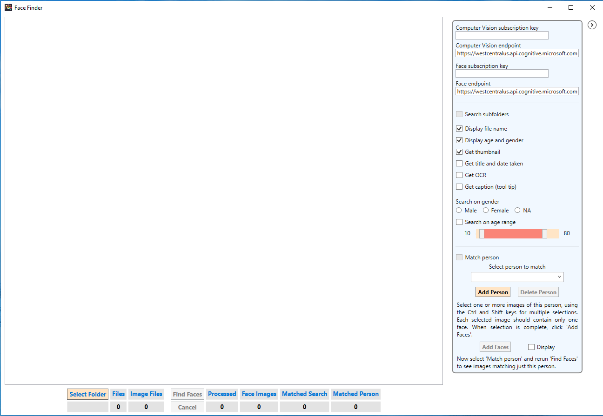
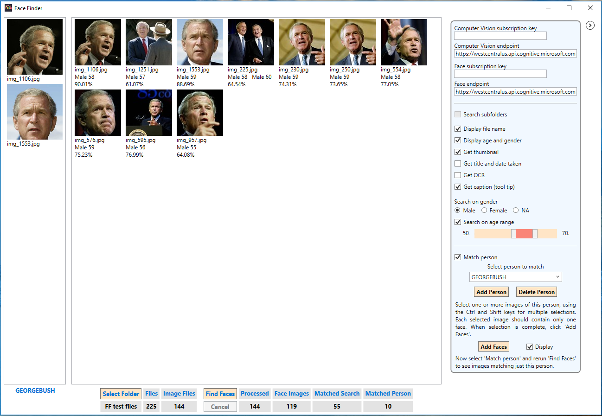

# Face Finder

This sample searches a folder for image files containing a face. Selected attributes of the image and face are displayed. Searches can be filtered by age range, gender, and whether the face matches a specified person. The sample uses the [Windows client libraries](https://www.nuget.org/packages?q=Microsoft.Azure.CognitiveServices.Vision) for the [Computer Vision](https://docs.microsoft.com/azure/cognitive-services/computer-vision/) and [Face](https://docs.microsoft.com/azure/cognitive-services/face/) services of [Azure Cognitive Services](https://docs.microsoft.com/azure/cognitive-services/).

## Features

* Parses a folder for image files of type bmp, gif, jpg, and png.
* Processes the image files to detect images containing a face.
* Displays thumbnails of each image that has a face, along with attributes associated with the image and face.
* Available attributes are:
  * age and gender
  * caption (as a tool tip)
  * printed character recognition (OCR)
  * date image taken and title, if available
  * The sample can be easily extended to display additional attributes such as handwritten text and object identification.
* Image files can be filtered on:
  * age range
  * gender
  * matching person/face
* Finds all images with a face that matches a specified person.

## Getting Started

### Prerequisites

* You need **subscription keys** for the Computer Vision and Face services to run the sample. You can get free trial subscription keys from [Try Cognitive Services](https://azure.microsoft.com/try/cognitive-services/).
* Any edition of [Visual Studio 2017](https://www.visualstudio.com/downloads/) with the .NET Desktop application development workload installed.
* A folder containing image files with faces. To ideally demonstrate the person matching feature, the folder should contain multiple images of the specified person.

### Quickstart

1. Clone or download the repository.
1. Open the *FaceFinder* folder in the repository.
1. Double-click the *FaceFinder.sln* file, which opens the project in Visual Studio.
1. Build the project, which installs the Computer Vision and Face service NuGet packages.
1. Run the program.

## Walkthrough

Face Finder provides two modes of operation.

The first mode searches a folder for images that contain at least one face and displays information about these images and faces. To be recognized, a face must at least partially show both eyes. Searches can be filtered by age range and gender.

To start:

1. Click the expander button on the upper right of the screen.
1. Enter your Computer Vision and Face **subscription keys** in the appropriate text boxes.
1. The default **endpoint** for both services is `https://westcentralus.api.cognitive.microsoft.com`. Change the service endpoints to match the region associated with your subscription keys, if necessary. Note that the new Vision services client libraries automatically add the service name and method to the endpoint.
1. Select the search criteria. The **Match person** checkbox is disabled until a person is specified in the bottom section of the pane (described below).
1. Click **Select Folder** and browse to a local folder containing images that you want to search for faces.
    * Valid image file types are bmp, gif, jpg, and png.
    * An image can contain multiple people.
    * A face doesn't have to be prominent but must show both eyes to be detected.
1. Click **Find Faces**, which searches the folder for image files and then analyzes these files for faces. If you want to stop the search early, click  **Cancel**.

Note: When **Get thumbnail** is selected, a subfolder named *FaceThumbnails* is created under the selected folder to store the thumbnails created by the Computer Vision service.

The following screenshot shows the opening screen with the settings pane displayed.

The following screenshot shows the results after a search of the selected folder for males between the ages of 50 and 70. The thumbnails are generated by the Computer Vision service from the images that matched the search criteria. Notice the tool tip on the top right image showing the caption from Computer Vision's analysis of the image. The metrics displayed below the thumbnails show the

* name of the selected folder
* number of files in the folder
* number of image files (bmp, gif, jpg, and png) in the folder
* live processing count
* number of image files containing a face
* number of images with faces that match the search criteria
* number of images with faces that match the search criteria and the selected person

The second mode additionally filters the images to those with a face that match a specified person.

To filter by person:

1. Type a name for the person in the combo box and click **Add Person**.
1. Select one (or more) images of this person, using the Ctrl and Shift keys for multiple selections. Each selected image should contain only one face.
1. When selection is complete, click **Add Faces**, which associates the faces with the specified person.
1. Click **Display** to see the selected images in the left pane.
1. Select the **Match person** checkbox.
1. Click **Find Faces** to start the search over again. This time, only images that match the person are displayed.

The following screenshot shows the results after searching for images that match the specified person. The images used to define the person are shown in the left pane. In the middle pane, each thumbnail now shows the confidence level that the face does match the person. Images where the confidence is less than 50% aren't considered a match. The bottom panel additionally shows the name you gave the person and the number of matched face images.

A person and their associated images are persisted. To delete a person and their images:

1. Select the person in the combo box.
1. Click **Delete**. A confirmation dialog appears for approval.

Images in these screenshots are a collated collection from [Labeled Faces in the Wild](http://vis-www.cs.umass.edu/lfw/). For a more easily accessible dataset of ordinary people in everyday life, see [People In Photo Albums (PIPA): Test 3G](https://people.eecs.berkeley.edu/~nzhang/piper.html), available under a creative commons license.

## Resources

* [Computer Vision service documentation](https://docs.microsoft.com/azure/cognitive-services/computer-vision/)
* [Computer Vision API - v2.0](https://westus.dev.cognitive.microsoft.com/docs/services/5adf991815e1060e6355ad44/operations/56f91f2e778daf14a499e1fa)
* [Microsoft.Azure.CognitiveServices.Vision.ComputerVision 3.2.0](https://www.nuget.org/packages/Microsoft.Azure.CognitiveServices.Vision.ComputerVision/3.2.0) client library NuGet package
* [Face service documentation](https://docs.microsoft.com/azure/cognitive-services/face/)
* [Face API](https://docs.microsoft.com/azure/cognitive-services/face/apireference)
* [Microsoft.Azure.CognitiveServices.Vision.Face 2.2.0-preview](https://www.nuget.org/packages/Microsoft.Azure.CognitiveServices.Vision.Face/2.2.0-preview) client library NuGet package